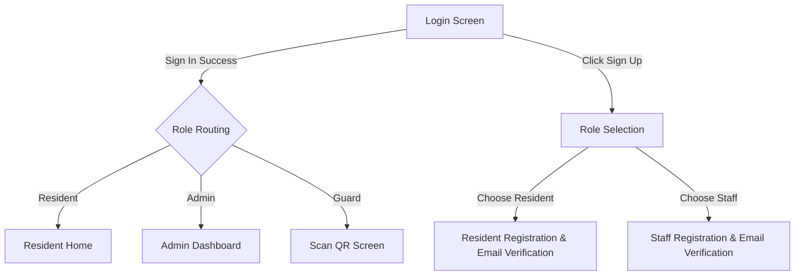
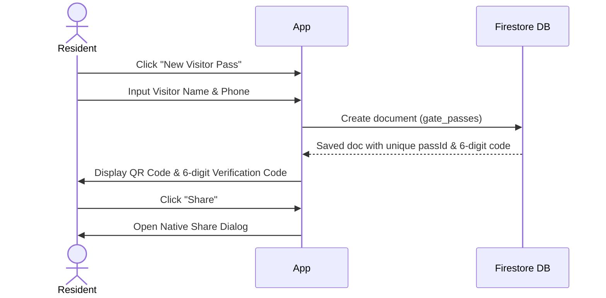
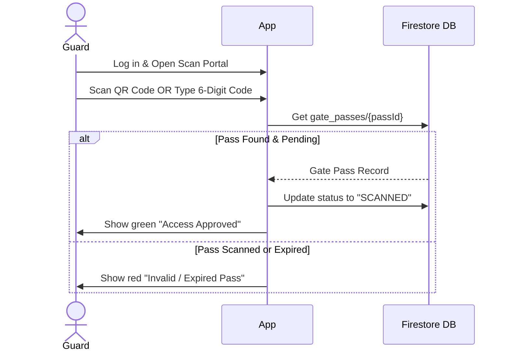
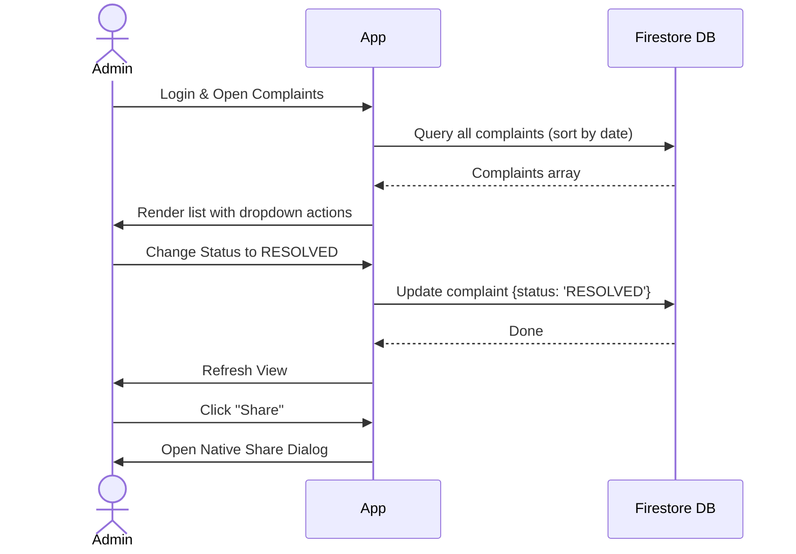

# SocietyEase: Software Requirements Specification (SRS)

## 1. Introduction
SocietyEase is a modern, premium web application designed to manage the daily operations of a housing society. It serves as a central hub for residents, security guards, and administrators to communicate, manage visitors, handle maintenance bills, and track complaints.

Following the recent UI/UX overhaul, the platform now features a world-class design language utilizing glassmorphism, fluid micro-interactions, and motion design.

## 2. User Roles
The application strictly enforces three different user roles:
- **🏠 Resident**: Primary users living in flats.
- **🛡️ Security Guard**: Frontline security personnel tracking visitors.
- **👔 Administrator**: Management committee overseeing operations and finances.

## 3. Authentication Flow & Security
All users sign in using their **Email and Password**. The system instantly identifies their role and redirects them to their specific dashboard. 
- **Role-Based Registration**: New users must register, with Staff (Guards/Admins) requiring a special Access Passcode (e.g., `ADMIN_SECURE_123`) to authorize their account creation.
- **Email Verification**: A mandatory email verification step has been added. New accounts will receive a verification link, and users must verify their email before accessing their respective portals.

## 4. Feature Workflows (What can each user do?)

### 🏠 Resident Workflow
When a resident logs in, they are taken to the **Resident Dashboard** where they can view notices, track maintenance bills, and raise complaints.

**Key Capabilities:**
1. **Visitor Passes**: Residents can click "New Visitor Pass" and enter visitor details to generate a secure QR Code and a unique 6-digit Verification Code.
2. **Share Content**: Residents can easily share maintenance bills and visitor pass details externally using the new **Universal Share Option**.

### 🛡️ Security Guard Workflow
When a guard logs in, they are taken to the **Scanner Portal**.

**Key Capabilities:**
1. **QR & Verification Code**: When a visitor arrives, the guard can either scan the visitor's QR code or manually type in the 6-digit Verification Code.
2. **Verification**: The system instantly checks the database to confirm validity.
3. **Visitor Logs**: The guard can view a real-time list of all checked-in visitors and share specific gate log details when necessary.

### 👔 Administrator Workflow
When an admin logs in, they see a high-level **Command Center** with KPIs (Key Performance Indicators). They can manage residents, issue maintenance bills, and post notices.

**Key Capabilities:**
1. **Manage Complaints**: Admins can update complaint statuses (Pending, In Progress, Resolved).
2. **Track Expenses**: They can log society expenditures and generate reports.
3. **Broadcast Notices**: Admins can issue notices to the entire society.
4. **Universal Sharing**: Admins can share individual complaints, notices, and billing invoices using the built-in share functionality.

## 5. Behind the Scenes (Technical Overview)
- **Frontend Stack**: React, TypeScript, Vite.
- **Premium UI/UX**: Custom Tailwind CSS v4 variables with Framer Motion (`framer-motion`) powering page reveals, staggered list animations, and interactive hover states.
- **Database (Firestore)**: Cloud-synced NoSQL database providing real-time UI updates across all devices.
- **Security**: Strict Firestore Security Rules isolate data by role, paired with Firebase Authentication (with Email Verification).
- **QR Generation**: External APIs (`api.qrserver.com`) instantly create scan-ready QR images for visitor passes.
